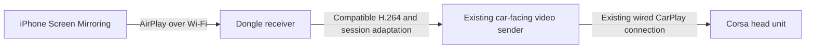

# Ordinary screen mirroring through the HW501

2026-09-19. The Mac prototype has progressed to an RV32 receiver and experimental
device bridge. A [flashable update](../../experiments/mirroring/FLASHING.md) is
built and checked offline. Mirroring has not yet been tested on the dongle/Corsa.

## Proposed architecture

The phone would show its ordinary mirrored screen rather than the CarPlay interface. The dongle would continue acting as a CarPlay accessory to the car; no alternative display transport into the Corsa has been identified.

Unlike a pixel overlay, this design could avoid local video decoding and encoding **if** the phone supplies a stream the head unit can accept. Matching the codec name alone is insufficient: parameter sets, profile/level, dimensions, framing, timing, session state, and resolution transitions need validation. A successful static landscape image should precede audio and rotation support.

## Existing firmware evidence

- The main executable links `libAirPlay.so`, `libAirPlaySupport.so`, and `libCarLifeStub.so`.
- `libAirPlay.so` exports `AirPlayReceiverServerCreateWithConfigFilePath`, `AirPlayReceiverSessionSetup`, and `AirPlayReceiverSessionStart`; it contains `/etc/airplay.conf`, `_airplay._tcp.`, `/pair-setup`, `/pair-verify`, and CarPlay control discovery strings.
- The application explicitly implements CarPlay session/control state. These AirPlay APIs and strings do **not** prove that ordinary Control Center mirroring is enabled or that changing discovery flags would make it work.
- The [video-path investigation](feasibility.md) identifies the encoded-video callback and outgoing sender. This is the reusable half of the proposed bridge.
- The archived update covers the application partition, not `/etc` in the base rootfs. We have not read the live `airplay.conf` contents.

## Reference receiver and compatibility constraints

[UxPlay's upstream documentation](https://github.com/FDH2/UxPlay) demonstrates ordinary AirPlay mirroring reception and forwarding decrypted compressed video without rendering through its `-vrtp` mode. It is a reference implementation, not an already compatible dongle package. Porting its receiver or adapting callbacks would require a RISC-V build, dependencies, storage budgeting, and integration with the proprietary sender.

UxPlay also documents that requested resolution is advisory: actual dimensions can change with the source image and orientation. Thus requesting 800×480 is not proof that passthrough into the Corsa will work. If the head unit cannot accept the mirrored geometry, a scaling/transcoding path may bring back the decoder limitation identified for overlays.

[Apple's mirroring instructions](https://support.apple.com/en-au/102661) describe selecting a receiver from Control Center on the same Wi-Fi network. The intended user flow is to join the adapter's network and choose its mirroring receiver there, once implemented. Compatibility with this user's iOS 27 remains untested.

Initial scope should be video-only and controlled from the phone. Car-screen touch control of the phone is a separate capability and has not been established. Protected-video applications may not mirror through an open-source receiver; UxPlay explicitly documents its Apple video-DRM limitation.

## Implementation checkpoints

### Connection mode selection

User requirement: keep both **CarPlay** and **Screen Mirroring** selectable from
the adapter's settings page. Proposed label: **Connection mode**. Default to
CarPlay and persist the selected mode across power cycles. For the first
implementation, apply changes on adapter restart; live switching can follow
once session teardown is understood.

- **CarPlay:** use the existing phone connection and display-density settings.
- **Screen Mirroring:** suppress phone-side CarPlay auto-connection, advertise
  the mirroring receiver, and let the user choose it in iPhone Screen Mirroring.
  Keep the settings page accessible so the user can return to CarPlay.
- Both modes still need the stock car-facing wired CarPlay session and sender.
  Stopping the entire stock application would also stop that path; service
  selection must distinguish phone-side reception from car-side transport.

The stock web page reads `getboxsettings` and posts `updateboxsettings`, with a
message that changes take effect next time. Its existing **Media mode** changes
`audiomode`; it is unrelated to this selector. A new persistent field and backend
handling are required. Stock acceptance/storage of an extra field has not been
established, so adding only a picker would not implement mode switching.

The [native selector service](../../experiments/mode/README.md), web UI,
persistence, and driver dispatch are implemented, with native and RV32/QEMU
tests. An experimental launcher and preload bridge now connect the driver to
phone-side startup hooks and the stock video callback. The firmware builder
includes both settings-page links and validates the update image. Complete
on-device startup/session behavior remains unverified.

### Receiver and forwarding

1. Establish receiver discovery, pairing, and an ordinary mirroring session independently of the phone's CarPlay control connection. Determine whether the stock receiver can do this before replacing it.
2. Capture negotiated codec configuration and actual dimensions; compare them with the car-facing stream requirements.
3. Forward a compatible landscape video stream using the existing sender and required car-side session state. Preserve the current CarPlay/density mode as a separate fallback.
4. Validate disconnects and parameter-set changes; add audio and orientation handling only after video works.

The Mac prototype implements discovery, PIN handling, and a bounded H.264 capture
sink using the pinned UxPlay protocol library. Local endpoint/capture tests are
available; ordinary mirroring from the user's iOS 27 phone is still untested.
None of the checkpoints has been demonstrated end to end on the dongle. This is
a more plausible reuse of the existing compressed-video path than a live pixel
overlay, but it remains a development project rather than a discovered setting.
